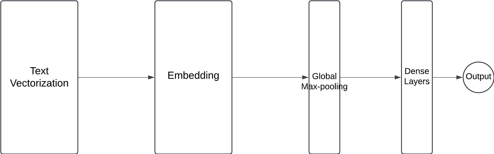
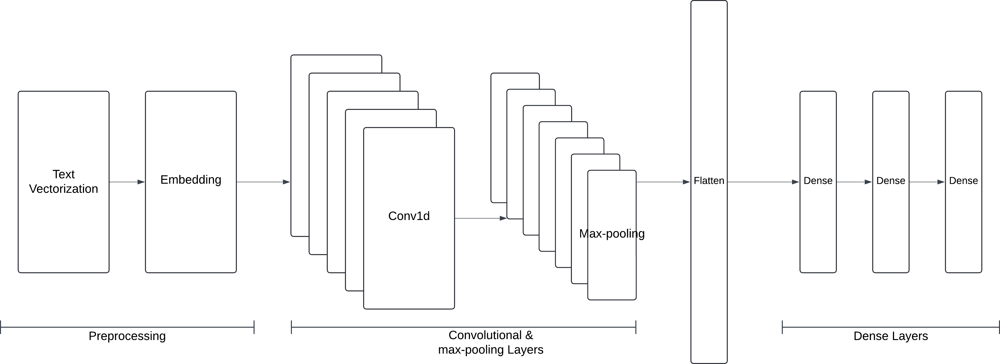
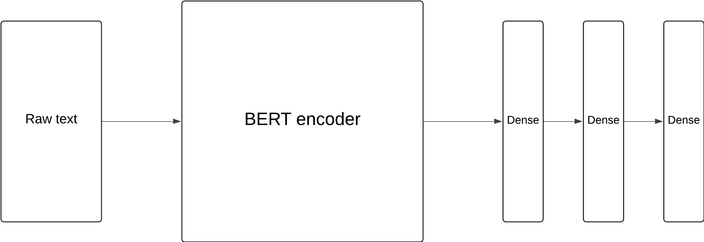
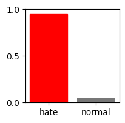
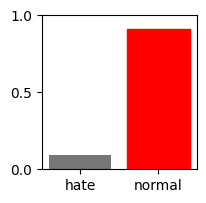
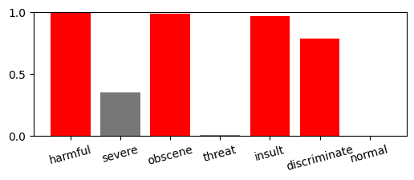
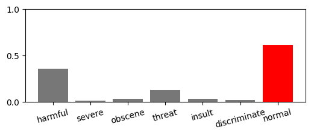
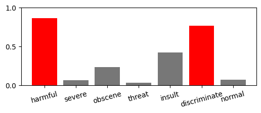

# Project Structure
- AI-models/
    - BERT_hateful_comment_classification.ipynb
    - binary_classification_comment_dataset.ipynb
    - multilabel_classification_comment_dataset.ipynb
    - visualise_comment_dataset.ipynb
- dataset: contains cleaned and preprocessed dataset
- img/
- saved-models: contains saved models after training

# Machine Learning Models

The project perform an NLP task of classifying hateful language using 3 different machine learning models, from simple to complex, with abilities to capture context.

I start with simple neural networks that convert text into embedding vectors and learn patterns. However, these models are not very effective at capturing context. To address this, I use a CNN model that extracts local features and learns from them. Despite this improvement, the model is still limited in its ability to understand context fully.

BERT, however, offers a different representation where the same word can have different values depending on the context. This progression reflects the increasing sophistication of models in capturing the richness and complexity of human language.

## Simple Neural Network

**Text Vectorization:** this layer will split a sentence into individual words and map each word to an interger in which computer can understand. For example: "I love cat" -> [23, 4, 67]

**Embedding:** this layer creates vector space of dimensions **embedding_dim**, and map the encoded word to a vector, capturing the semantic relationship between them.

**Global Max-pooling:** as the name inferred, the layer extracts the max value embedding vector. This reduces the dimenionality of output, ready to feed into next layer.

**Dense Layers:** fully connected neural networks that learn the complex patterns.

**Dropout Layers:** this layer dropout some neurons, preventing overfitting and forcing model learn more robust features.

## Convolutional Neural Network (CNN)

**Text Vectorization & Embedding:** convert text into vector in multi-dimensional space.

**Convolutional Layers (Conv1D):** this layer apply filters that slide across the embedding vector, extracting local featuers and patterns.

**Max-pooling Layers:** this layer reduces the dimensionality of the features vectors. It retains the most prominent features from previous convolution layer, enforcing the learning process.

**Flatten Layer:** this layer flattens the multi-dimensional vector into a single-dimensional vector, ready to fed into dense layers.

**Dense Layers:** fully connected neural networks that learn the complex patterns.

## BERT model

**BERT encoder:** this is a pre-trained language model that can understand context if text. This layer transforms the text into a numerical vector that captures the meaning and relationships between words.

**Dense Layers:** fully connected neural networks that learn the complex patterns.

*A word can have multiple meanings depending on the context. BERT embeddings represent words based on their context and surrounding words, while traditional word embeddings represent words independently of their context.*

# Outcome
This section presents the predictions of three distinct classification models.

| Binary Classification |  |
|---|---|
| Wish you cut your veins. Don't shout out you have mental problem | that's funny, I always pay them and I've never been to lunch |
|  |  |

| Multi-labeled Classification (CNN) |
|---|
| You idiot |
|  |

| Multi-labeled Classification (BERT) |
|---|
| I hate myself |
|  |
| I hate gay people |
|  |